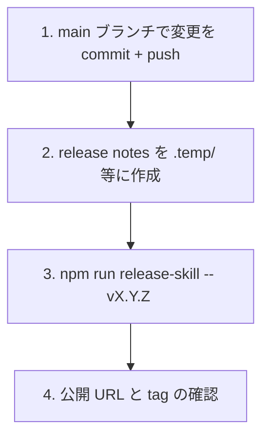

# 開発ガイド

## 前提条件

- Node.js >= 23.6（CI は `.nvmrc` で pin した version を使う）
- npm
- 隔離子プロセスに応じた CLI:
  - `guarded-*-codex` 系 → `codex` コマンド

## セットアップ

devcontainer を使う場合は VS Code / GitHub Codespaces で開くと `postCreateCommand` 経由で自動セットアップされる。手動の場合:

```sh
bash local_setup.sh
```

`local_setup.sh` の主な処理:

1. コンテナディスクの掃除（`scripts/clean-devcontainer-disk.sh --threshold 90`。満杯だと後続の `npm ci` 自体が書き込めないため最初に実行する）
2. `npm ci`（初回は `npm install`）
3. `claude` / `codex` / `vp` / `typescript-language-server` のシンボリックリンク作成 + `claude` のインストール処理
4. `.claude/settings.local.json` / `CLAUDE.local.md` の初期化（example からコピー）
5. `gh auth login` + `gh skill install` でデフォルト skill と自リポジトリの skill をインストール
6. `python3` / `bubblewrap` のインストール
7. git hooks パス設定（`.githooks/`）
8. `git config --global core.pager 'less -FRX'`（Oh My Zsh の LESS 設定との衝突回避）

## コマンド

| コマンド                    | 説明                                         |
| --------------------------- | -------------------------------------------- |
| `npm run test`              | テスト実行（vitest）                         |
| `npm run check`             | lint / fmt / type チェック一括実行           |
| `npm run check:fix`         | 自動修正付きチェック                         |
| `npm run sync-shared`       | `shared/` → 各 skill `scripts/` へコピー同期 |
| `npm run sync-shared:check` | コピーが正本と一致するか検証                 |

品質ゲートは npm scripts に集約し、エージェント hook・pre-commit hook・CI がすべて同じものを実行する。`vp` を直接叩いても同じ処理が走るが、検証内容を変更する場合は npm scripts と `.agents/scripts/*` を更新して全経路へ反映させる。

## コンテナディスクの掃除

VS Code server / npm / agent のキャッシュはコンテナディスク上で再蓄積し、放置すると ENOSPC で Bash ツールを含む全書き込みが停止する。`scripts/clean-devcontainer-disk.sh` が固定 allowlist 内の再生成可能キャッシュだけを冪等に回収する。

| コマンド                                                 | 用途                                                                  |
| -------------------------------------------------------- | --------------------------------------------------------------------- |
| `bash scripts/clean-devcontainer-disk.sh --dry-run`      | 削除せず候補・skip 理由・回収見込みだけを表示する                     |
| `bash scripts/clean-devcontainer-disk.sh`                | 閾値を見ずに無条件で回収する（手動実行）                              |
| `bash scripts/clean-devcontainer-disk.sh --threshold 90` | 使用率 90% 以上、または空き容量が既定下限 5GiB 未満のときだけ回収する |
| `npm test -- scripts/clean-devcontainer-disk.test.ts`    | 契約テスト                                                            |

`local_setup.sh`（初回）と `postStartCommand`（毎起動）は `--threshold 90` で呼ぶ。掃除の非 0 終了と script 不在は警告に変換され、setup と container 起動をブロックしない。終了コードは 0 が正常系（no-op / safety skip を含む）、1 が operational failure、2 が引数エラー。

対象は `~/.vscode-server/extensionsCache`、`~/.npm/_cacache`、`~/.local/share/cursor-agent/versions`、`~/.codex/.tmp`、および共有 mount でないと証明できる場合の `/vscode/vscode-server/extensionsCache` に固定されている。削除 root を任意の path へ向ける引数や専用の環境変数はない。唯一の例外はテスト専用の `--test-root` で、canonical path が repository の `.temp/` 自身かその配下のときしか受理しない。

使用中リソースは削除しない。process listing が取得できない場合や、共有 `/vscode` volume 上のように他コンテナの liveness を証明できない場合は、category ごと skip して理由を報告する。`/vscode/vscode-server/bin` の世代は手動確認候補として表示するだけで自動削除しない。

cursor-agent の世代（`local_setup.sh` が Cursor CLI をインストールするため蓄積する）は、最大日付の全世代と `~/.local/bin/agent` symlink が指す世代を retained set として固定し、それ以外だけを候補にする。同一日付の複数世代は git hash 順と release 順が一致しないため曖昧として全保持する。削除中は各削除の直前に retained set の存在・type・identity を再確認し、変化していれば残り候補を skip する。

例外は npm の `_cacache` で、ここは process 状態を見ずに `npm cache clean --force`（失敗時は canonical path 検証済みの直接削除）で回収する。content-addressed cache で、削除しても次回取得で復元されるため。

### ディスク不足時の手動実行

`df -Ph /` の空きが少ないとき、書き込みエラーが出たとき、起動時掃除が「掃除後も閾値を超過している」と警告したときは、閾値を待たずに手動で回収する。

```sh
# 1. 何が消えるか、どれだけ回収できるかを先に確認する（ファイルシステムは変更しない）
bash scripts/clean-devcontainer-disk.sh --dry-run

# 2. 閾値を見ずに回収する
bash scripts/clean-devcontainer-disk.sh
```

出力の `candidate` が回収見込み、`skip` は安全に削除できないと判定した分、`manual-candidate` / `manual-only` は自動削除しない手動確認候補を示す。末尾の集計表で category ごとの回収量・skip 量・未回収量を確認する。

削除されるのは再生成可能なキャッシュだけで、消えても次回の利用時に再取得される（VS Code 拡張のダウンロードキャッシュ、npm の `_cacache`、cursor-agent の旧世代）。拡張本体、cursor-agent の最新世代、使用中のプロセスが参照している entry は削除しない。連続実行しても安全で、2 回目以降は候補なしの no-op になる。

スクリプト自身は一時ファイルを作らないため、使用率 100% でも実行できる。ただし `npm cache clean --force` は npm 側が書き込めず失敗し得るので、その場合は検証済みの `_cacache` 直接削除へフォールバックし、npm 経路の失敗として exit 1 を返す（回収自体は行われる）。

### ENOSPC 時の診断順

1. `df -PhT / /workspaces/skills` でコンテナ側（overlay）と repository 側（host mount）を区別する。repository が host mount なら `.temp/` はコンテナディスクを圧迫していない
2. `bash scripts/clean-devcontainer-disk.sh --dry-run` で回収見込みと skip 理由を確認し、必要なら引数なしで実行する
3. 掃除後も閾値を超える場合はスクリプトが警告を出す。手動確認候補（`/vscode/vscode-server/bin` の世代、共有 volume 上の entry）は、その volume を使う全 container の停止を確認したうえで手動で削除する
4. コンテナ側で解消しない場合は host で `docker system df` を実行し、image / container / local volume / build cache の内訳を確認する。内訳で実際に大きい種別だけを対象にし、`docker system prune`・named volume の個別削除・Docker Desktop の仮想ディスク reclaim はそれぞれ削除対象と危険性を確認したうえで別手順として実行する

## エージェント hook

Claude / Codex の hook は、編集後に直接 `vp` や `tsc` を呼ばず、共通 wrapper を呼ぶ。

```text
Claude / Codex
  └─ PostToolUse(Edit|Write|apply_patch)
      └─ .agents/scripts/check-file.sh <file>
          └─ npm run check:fix -- <file>
```

wrapper:

| ファイル                         | 役割                                 |
| -------------------------------- | ------------------------------------ |
| `.agents/scripts/check-file.sh`  | 編集直後の軽量なファイル単位チェック |
| `.agents/scripts/check-all.sh`   | ローカルの総合検証                   |
| `.agents/scripts/self-review.sh` | commit 前のセルフレビュー補助        |

プロジェクト固有の検証を追加する場合は、`.claude/` や `.codex/` ではなく `.agents/scripts/*` を更新する。この構造により、テンプレート更新時に `.claude/` / `.codex/` をそのまま差し替えられる。

hook 実体は `.claude/hooks/check-file.js`（Claude）と `.codex/hooks/run-check-file.ts`（Codex）で、どちらも wrapper へ委譲するだけの薄い層に留める。Codex 側は `apply_patch` の追加・更新・移動先ファイルも対象にするため、抽出ロジックの in-source test を持つ。

## LSP

`CLAUDE.md` は TypeScript の調査・検証に Claude Code の `LSP` tool を使うよう指示している。これを提供するのは project scope の `typescript-lsp` plugin で、有効化は `.claude/settings.json` の `enabledPlugins` に記録されている。clone 後の追加操作は要らない。

`.claude/.lsp.json` を置く形では動かない。Claude Code は plugin root（`.claude-plugin/plugin.json` を持つ directory）からしか LSP 設定を読まないため、`.claude/` 直下に置いたファイルは無視される。

## CI

`.github/workflows/ci.yml` が pull request と `main` への push で走る。`.nvmrc` で pin した Node の clean checkout で `npm ci` → `npm run sync-shared:check` → `npm run check` → `npm test` を順に実行する。

pre-commit hook と同じゲートを、ローカル環境に依存しない状態で再実行するのが目的。step を分けているのは、失敗した gate が GitHub の UI 上で特定できるようにするため。

## テスト

vitest の in-source testing を採用している。テストは各スクリプト末尾の `if (import.meta.vitest)` ブロックに記述する。テスト対象は `vite.config.ts` の `includeSource` で制御する:

- `shared/**/*.ts` — 共有実装の正本
- `skills/*/scripts/pipe-sanitize*.ts` — 各 skill 固有のパイプ処理
- `skills/*/scripts/http-fetch*.ts` — direct HTTP fetcher
- `.codex/hooks/**/*.ts` — Codex の hook スクリプト（ファイル単位チェックの委譲等）

`skills/*/scripts/sanitize.ts` と `codex-jsonl.ts` は `shared/` から自動生成されたコピーのため、テスト対象から除外している。

shell script は in-source test を持てないため、`scripts/<name>.test.ts` に独立した契約テストを置く（`scripts/clean-devcontainer-disk.test.ts` が例）。Vitest 既定の `include` で収集される。子プロセスで script を起動し、PATH 先頭に置いた fake command で観測値と成否を制御する。fixture は repository の `.temp/` 配下に作り、`onTestFinished` で回収する。子プロセス起動を伴うため `vite.config.ts` の `testTimeout` を 30 秒にしている。

子プロセスを起動できない sandbox では、この種のテストは製品の回帰と区別がつかない形で失敗する。切り分けが必要なら実行前の capability preflight を別途用意する。

## ディレクトリ構成

編集対象は役割によって 2 つに分かれる:

- **公開対象 (`skills/`)**: 各 skill の SKILL.md / references / 固有スクリプト (`pipe-sanitize-*.ts`, `quarantine-*.sh` 等) を編集する。`gh skill publish` でリリースされる canonical
- **共有実装の編集対象 (`shared/`)**: 複数 skill で共有する実装の正本 (`sanitize.ts`, `codex-jsonl.ts`)。ロジック更新はここで行い、`npm run sync-shared` で各 skill にコピーを配布する

**直接編集してはいけないファイル**: `skills/<skill-name>/scripts/sanitize.ts` と `skills/<skill-name>/scripts/codex-jsonl.ts` は `shared/` から `scripts/sync-shared.ts` で自動生成されたコピー。直接編集すると `.githooks/pre-commit` の `sync-shared:check` で検出されコミットがブロックされる。

`.claude/skills/` は dogfooding (この repo を Claude Code で開いた際に自スキルを読み込ませる) のためのインストール先で、`local_setup.sh` が `gh skill install --from-local` で `skills/` から取り込む。`.gitignore` 対象。

各 skill の `scripts/sanitize.ts` / `codex-jsonl.ts` は自動生成された実体コピーとして git 管理下に置かれるため、各 skill は self-contained で動作する（`gh skill install` 単独でインストール可能）。

凡例: 注釈なしのファイルは通常の編集対象。`⛔` は編集禁止 (自動生成)、`📦` はビルド生成物。

```
.agents/
  scripts/                      # Codex / Claude / 人間で共有する検証 wrapper
    check-file.sh               # 編集直後のファイル単位チェック
    check-all.sh                # ローカルの総合検証
    self-review.sh              # commit 前のセルフレビュー補助
  skills/                       # 📦 .gitignore 対象、Codex 向け skill インストール先

.claude/
  hooks/check-file.js           # Claude の PostToolUse hook (wrapper へ委譲)
  settings.json                 # hooks / enabledPlugins (typescript-lsp)

.codex/
  hooks/run-check-file.ts       # Codex の PostToolUse hook (wrapper へ委譲)
  hooks.json                    # hook 登録
  rules/default.rules           # read-only コマンドの承認プロンプト削減
  config.toml                   # model / features / 環境変数

.github/
  workflows/ci.yml              # clean checkout での sync-shared:check / check / test

docs/
  archive/                      # 完了した寿命付きドキュメント
  bugs/                         # バグ起票テンプレートと起票済みバグ
  design/                       # 永続資料 (本書)
  feature/                      # 設計・実装プランテンプレート
  refactoring/                  # リファクタリング計画テンプレート

shared/                         # 共有実装の正本
  sanitize/
    sanitize.ts                 # テキストサニタイズ (guarded 系 skill 共通)
  codex-jsonl/
    codex-jsonl.ts              # Codex JSONL 抽出 (codex 系 2 skill 共通)

scripts/
  sync-shared.ts                # shared/ → 各 skill scripts/ へのコピー / 検証ツール
  release-skill.ts              # リリース検証 + gh skill publish + release notes 反映
  clean-devcontainer-disk.sh    # コンテナディスクの再生成可能キャッシュ回収
  clean-devcontainer-disk.test.ts # 上記の契約テスト

skills/                         # canonical (gh skill publish 対象)
  <skill-name>/
    SKILL.md                    # スキル定義 (フロントマター + 実行フロー)
    references/
      design-plan.md            # 設計計画・脅威モデル・割り切り
      *.toml / *.json           # Policy / Schema 等の設定ファイル
    scripts/
      check-node-version.sh     # Node.js バージョン事前チェック
      quarantine-*.sh           # 隔離プロセス起動のエントリポイント
      http-fetch-*.ts           # direct HTTP fetcher (webfetch-codex)
      pipe-sanitize-*.ts        # パイプ接続のサニタイザ (テスト内蔵)
      sanitize.ts               # ⛔ shared/sanitize/sanitize.ts から自動生成
      codex-jsonl.ts            # ⛔ (codex 系のみ) shared/codex-jsonl/codex-jsonl.ts から自動生成
      vendor/node_modules/      # ⛔ (imgedit-sharp のみ) update-vendor.sh で取り込む vendored 依存

.claude/skills/                 # 📦 .gitignore 対象、local_setup.sh で生成
  <skill-name>/...              # skills/ から gh skill install --from-local で取得
  skill-creator/                # gh skill install で導入される外部 skill
```

## shared/ 同期メカニズム

共有実装（`sanitize.ts` / `codex-jsonl.ts`）の正本は `shared/` にあり、`npm run sync-shared` で各 skill の `scripts/` に実体コピーを配布する。

ロジックを変更する場合は `shared/` の正本を編集し `npm run sync-shared` を実行する。`skills/<skill-name>/scripts/sanitize.ts` と `codex-jsonl.ts` を直接編集すると pre-commit hook でコミットがブロックされる。

## pre-commit hook

`.githooks/pre-commit` は三段の同期保証 + lint + テストでコミットを検証する:

1. **編集前の整合性チェック** (`sync-shared:check`) — generated コピーの直接編集を検出
2. **lint / fmt 自動修正** (`npm run check:fix`) — 修正不能なエラーがあれば commit を止める
3. **再同期** (`sync-shared`) — `check:fix` が `shared/` を書き換えた場合にコピーを追従
4. **ワークツリー変更の検出** — hook がファイルを書き換えた場合は変更内容を表示して exit 1 で止める
5. **最終ドリフト検証** (`sync-shared:check`) — それでもズレが残っていれば fail-closed でブロック
6. **テスト** (`npm run test`) — 全テスト実行

手順 1・3・5 が shared/ 同期の三段保証、手順 2 がコード品質、手順 6 が回帰検証を担う。

手順 4 で hook 自身は `git add` しない。commit 中の index lock と衝突させず、利用者が差分を確認してから `git add -u && git commit` で再ステージするため。

## ドキュメントプロセス

`docs/` 配下には 2 種類のドキュメントがある。

1. **永続資料**: `docs/design/` 配下。設計判断、開発手順など、長く参照される情報を書く
2. **寿命付きドキュメント**: `docs/bugs/`、`docs/feature/`、`docs/refactoring/` 配下。テンプレートから複製して起票し、完了後に `docs/archive/` へ移す

### バグ

- 必要に応じて [docs/bugs/bug-template.md](../bugs/bug-template.md) をコピーし、`docs/bugs/bug-<topic>.md` として起票する
- 再現手順、影響、修正方針、受け入れ基準を残す価値があるものだけを対象にする
- 修正完了後は `docs/archive/bug-<topic>.archive.md` にリネームしてアーカイブする

### 設計・実装プラン

- 大きめの機能追加や skill の公開仕様変更は [docs/feature/feature-plan-template.md](../feature/feature-plan-template.md) をコピーし、`docs/feature/<topic>.md` として起票する
- 完了後は README / 各 skill の `references/design-plan.md` に永続情報を移し、`docs/archive/<topic>.archive.md` にリネームする

### リファクタリング

- 挙動不変の構造改善は [docs/refactoring/refactoring-plan-template.md](../refactoring/refactoring-plan-template.md) をコピーし、`docs/refactoring/<topic>.md` として起票する
- skill の公開仕様や SKILL.md の契約を変える必要がある場合は feature plan として切り出す
- 完了後は `docs/archive/<topic>.archive.md` にリネームする

## リリースプロセス

`npm run release-skill -- vX.Y.Z <notes.md>` で GitHub Releases と `gh skill` レジストリに **同一の `vX.Y.Z` git tag で**公開する。
release notes ファイルは必須入力とし、publish 後に GitHub Release へ反映されたことまでスクリプトで検証する。

| 公開先                | 配布物                         | 公開コマンド                                 |
| --------------------- | ------------------------------ | -------------------------------------------- |
| GitHub Releases       | リリースノート（What's New）   | `npm run release-skill -- vX.Y.Z <notes.md>` |
| `gh skill` レジストリ | 各 skill（`gh skill install`） | `npm run release-skill -- vX.Y.Z <notes.md>` |

### 全体フロー



#### 1. main に変更を commit + push

リリース対象の変更がすべて main にマージされた状態にする。

#### 2. release notes を作成

```bash
$EDITOR .temp/release-notes-vX.Y.Z.md
```

publish が付ける auto notes は使わない。利用者向けの What's New を先に作成する。

#### 3. release-skill で検証 + 公開 + release notes 差し替え

```bash
npm run release-skill -- v0.1.0 .temp/release-notes-v0.1.0.md
```

スクリプトは以下を順に実行し、失敗した時点で停止する:

1. release notes ファイルの存在・非空チェック
2. 作業ツリーが clean であることを確認
3. `main` と `origin/main` が一致することを確認
4. リモート tag が未使用であることを確認
5. `vp check`
6. `vp test`
7. `gh skill publish --dry-run`
8. `gh skill publish --tag vX.Y.Z`
9. `git ls-remote --tags origin vX.Y.Z` で tag が `HEAD` を指すことを確認
10. `gh release edit vX.Y.Z --notes-file <notes.md>`
11. `gh release view vX.Y.Z` で release notes が反映済みであることを確認

### リリースチェックリスト

- [ ] リリース対象の変更がすべて main にマージ済み
- [ ] release notes を作成済み
- [ ] `npm run release-skill -- vX.Y.Z <notes.md>` がエラーなし
- [ ] 出力された GitHub Release URL を確認済み

## ローカル skill の再インストール

`skills/<skill-name>/` を編集した後で Claude Code から最新版を試すには、対象 skill を再インストールする:

```bash
gh skill install . <skill-name> --from-local --agent claude-code --scope project --force
```

## テンプレート更新運用

開発基盤（hook wrapper・git hooks・CI・devcontainer・ディスク掃除・docs テンプレート）は [typescript-agent-package-template](https://github.com/oubakiou/typescript-agent-package-template) から取り込んでいる。取り込み済み version は `.template.json` に記録する。

更新は tag 間の diff で取り込む:

```sh
git remote add template https://github.com/oubakiou/typescript-agent-package-template.git
git fetch template --tags
git diff v0.1.0..vX.Y.Z -- .agents/ .claude/ .codex/ .githooks/ .github/ docs/ scripts/
```

取り込み時の注意:

- プロジェクト固有の検証は `.agents/scripts/*` に置き、`.claude/` / `.codex/` はテンプレートのまま差し替えられる状態を保つ
- テンプレートは npm package 前提のため、`build` / `clean` / `pack:check` と `tsconfig.build.json` 系の変更は取り込まない。このリポジトリは `dist/` を持たず `gh skill publish` で配布する
- `scripts/clean-devcontainer-disk.sh` は cursor-agent category を足した拡張版を持つ。テンプレート側の更新を取り込む際は `in_list` / `retained_set_intact` / `clean_cursor_versions` と `revalidate_entry` の retained 引数を維持する（`local_setup.sh` が Cursor CLI をインストールするため、世代の蓄積が実際に起きる）
- CI はテンプレートの build / pack step を持たず、代わりに `sync-shared:check` を持つ
- 取り込み後は `.template.json` の version を更新する

## コーディング規約

エージェント・人間共通のルール。詳細は [AGENTS.md](../../AGENTS.md) を参照。

- `const` を既定とし、`let` は再代入が必要な場合のみ
- コメントは WHY が非自明な場合のみ書く（隠れた制約、workaround、読み手が驚く挙動）
- 現在のタスク・修正経緯・呼び出し元への言及はコメントに書かない（PR description に属する）
- 一時ファイルは `.temp/` 配下に作成する
- linter を無効化する前に無効化しない対応を検討し、やむを得ない場合はコメントで理由を記述する
