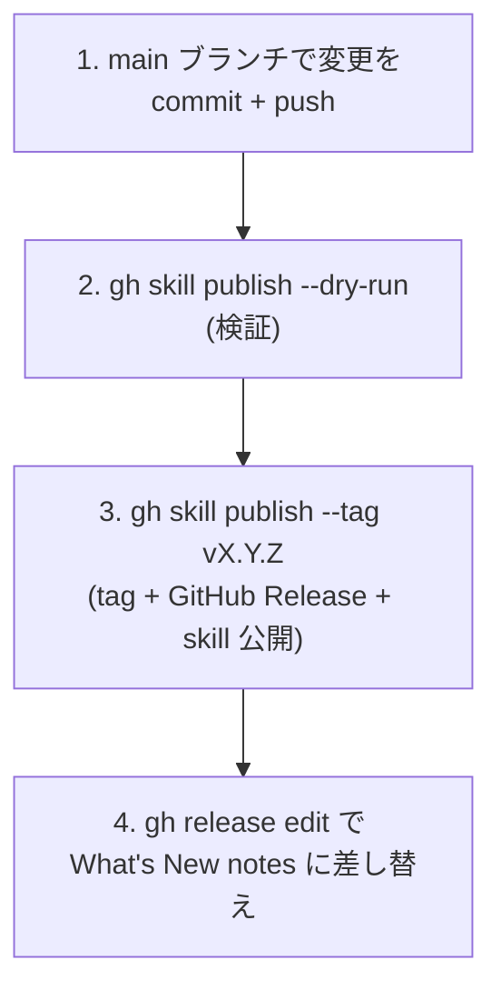

# 開発ガイド

## 前提条件

- Node.js >= 23.6
- npm
- 隔離子プロセスに応じた CLI:
  - `guarded-*-claude` 系 → `claude` コマンド
  - `guarded-*-codex` 系 → `codex` コマンド

## セットアップ

devcontainer を使う場合は VS Code / GitHub Codespaces で開くと `postCreateCommand` 経由で自動セットアップされる。手動の場合:

```sh
bash local_setup.sh
```

`local_setup.sh` の主な処理:

1. `npm ci`（初回は `npm install`）
2. `claude` / `codex` / `vp` / `typescript-language-server` のシンボリックリンク作成 + `claude` のインストール処理
3. `.claude/settings.local.json` / `CLAUDE.local.md` の初期化（example からコピー）
4. `gh auth login` + `gh skill install` でデフォルト skill と自リポジトリの skill をインストール
5. `python3` / `bubblewrap` のインストール
6. git hooks パス設定（`.githooks/`）
7. `git config --global core.pager 'less -FRX'`（Oh My Zsh の LESS 設定との衝突回避）

## コマンド

| コマンド                    | 説明                                         |
| --------------------------- | -------------------------------------------- |
| `vp test`                   | テスト実行（vitest）                         |
| `vp check`                  | lint / fmt / type チェック一括実行           |
| `vp check --fix`            | 自動修正付きチェック                         |
| `npm run sync-shared`       | `shared/` → 各 skill `scripts/` へコピー同期 |
| `npm run sync-shared:check` | コピーが正本と一致するか検証                 |

## テスト

vitest の in-source testing を採用している。テストは各スクリプト末尾の `if (import.meta.vitest)` ブロックに記述する。テスト対象は `vite.config.ts` の `includeSource` で制御する:

- `shared/**/*.ts` — 共有実装の正本
- `skills/*/scripts/pipe-sanitize*.ts` — 各 skill 固有のパイプ処理
- `skills/*/scripts/http-fetch*.ts` — direct HTTP fetcher
- `.codex/hooks/**/*.ts` — Codex の hook スクリプト（`vp check --fix` の自動実行等）

`skills/*/scripts/sanitize.ts` と `codex-jsonl.ts` は `shared/` から自動生成されたコピーのため、テスト対象から除外している。

## shared/ 同期メカニズム

共有実装（`sanitize.ts` / `codex-jsonl.ts`）の正本は `shared/` にあり、`npm run sync-shared` で各 skill の `scripts/` に実体コピーを配布する。ディレクトリ構成の詳細は [README.md](../../README.md) を参照。

ロジックを変更する場合は `shared/` の正本を編集し `npm run sync-shared` を実行する。`skills/<skill-name>/scripts/sanitize.ts` と `codex-jsonl.ts` を直接編集すると pre-commit hook でコミットがブロックされる。

## pre-commit hook

`.githooks/pre-commit` は三段の同期保証 + lint + テストでコミットを検証する:

1. **編集前の整合性チェック** (`sync-shared:check`) — generated コピーの直接編集を検出
2. **lint / fmt 自動修正** (`vp check --fix`) — 修正があれば自動再ステージ
3. **再同期** (`sync-shared`) — `vp check --fix` が `shared/` を書き換えた場合にコピーを追従
4. **最終ドリフト検証** (`sync-shared:check`) — それでもズレが残っていれば fail-closed でブロック
5. **テスト** (`vp test`) — 全テスト実行

手順 1・3・4 が shared/ 同期の三段保証、手順 2 がコード品質、手順 5 が回帰検証を担う。

## リリースプロセス

`gh skill publish` で GitHub Releases と `gh skill` レジストリに **同一の `vX.Y.Z` git tag で**公開する。

| 公開先                | 配布物                                    | 公開コマンド                    |
| --------------------- | ----------------------------------------- | ------------------------------- |
| GitHub Releases       | リリースノート（What's New）              | `gh skill publish` が兼ねる     |
| `gh skill` レジストリ | 各 guarded 系 skill（`gh skill install`） | `gh skill publish --tag vX.Y.Z` |

### 全体フロー



#### 1. main に変更を commit + push

リリース対象の変更がすべて main にマージされた状態にする。

#### 2. dry-run で検証

```bash
gh skill publish --dry-run
```

`skills/*/SKILL.md` の `name` がディレクトリ名と一致するか、frontmatter の検証等をリリース前に行う。

#### 3. gh skill publish でタグ + Release + skill 公開

```bash
gh skill publish --tag v0.1.0
```

`--tag` を渡すと対話なしで publish する。タグは push 済みの main HEAD に切られるため、手順 1 の push を先に完了しておく。

#### 4. リリースノートを差し替え

```bash
gh release edit v0.1.0 --notes-file <notes.md>
```

publish が付ける auto notes を What's New 形式に置き換える。

### リリースチェックリスト

- [ ] リリース対象の変更がすべて main にマージ済み
- [ ] `vp check` がエラーなし
- [ ] `vp test` が全パス
- [ ] `gh skill publish --dry-run` がエラーなし
- [ ] `gh skill publish --tag vX.Y.Z` 後、tag が正しい commit を指す（`git ls-remote --tags origin vX.Y.Z`）
- [ ] `gh release edit` で What's New ノートに差し替え済み

## ローカル skill の再インストール

`skills/<skill-name>/` を編集した後で Claude Code から最新版を試すには、対象 skill を再インストールする:

```bash
gh skill install . <skill-name> --from-local --agent claude-code --scope project --force
```

## コーディング規約

エージェント・人間共通のルール。詳細は [AGENTS.md](../../AGENTS.md) を参照。

- `const` を既定とし、`let` は再代入が必要な場合のみ
- コメントは WHY が非自明な場合のみ書く（隠れた制約、workaround、読み手が驚く挙動）
- 現在のタスク・修正経緯・呼び出し元への言及はコメントに書かない（PR description に属する）
- 一時ファイルは `.temp/` 配下に作成する
- linter を無効化する前に無効化しない対応を検討し、やむを得ない場合はコメントで理由を記述する
